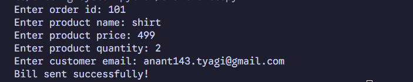
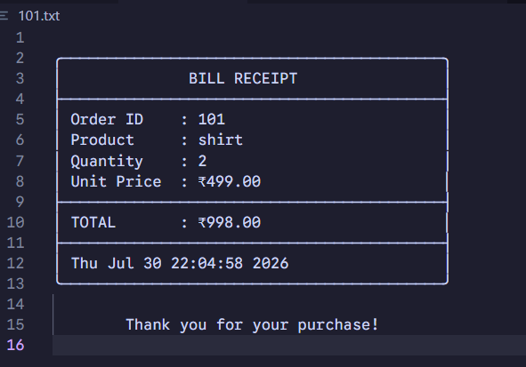
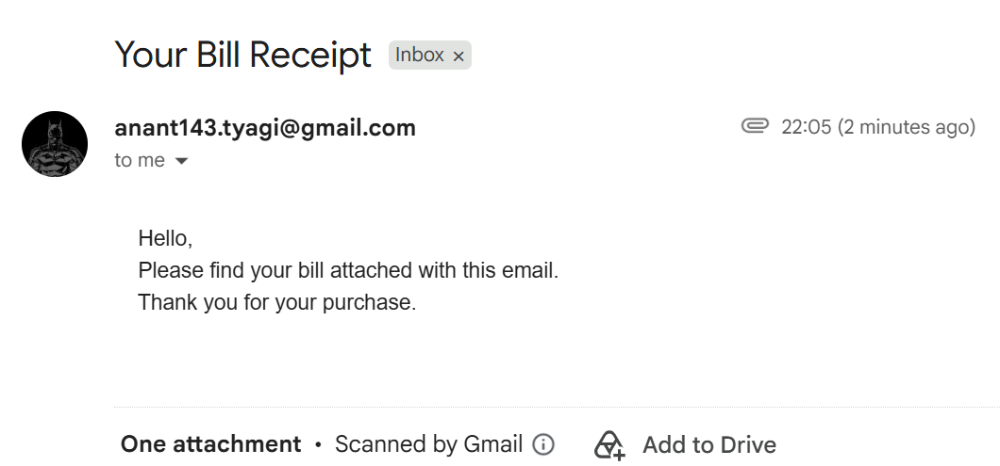

# 📄 Billing System using Python


A **Python-based Command Line Billing System** that generates formatted bill receipts and automatically sends them to customers via **Gmail SMTP**.

This project demonstrates Python fundamentals, file handling, email automation, environment variable management using **python-dotenv**, exception handling, and input validation.

---

# ✨ Features

- 📄 Generate formatted bill receipts
- 💰 Automatic total amount calculation
- 📧 Send bills as email attachments using Gmail SMTP
- 🔐 Secure email credential management using `.env`
- ✅ Input validation
- ⚠️ Exception handling for reliable execution
- 💻 Simple and beginner-friendly Command Line Interface (CLI)

---

# 📸 Screenshots

## Program Execution



---

## Generated Bill



---

## Email Sent Successfully



---

# 🛠 Technologies Used

- Python
- Gmail SMTP
- EmailMessage
- python-dotenv
- File Handling
- Exception Handling

---

# 📋 Requirements

- Python 3.10 or above
- Gmail Account
- Gmail App Password

---

# 📂 Project Structure

```text
billing-system-python/
│
├── email-bill.py
├── README.md
├── requirements.txt
├── .gitignore
├── .env.example
└── images/
    ├── program-output.png
    ├── generated-bill.png
    └── email-sent.png
```

---

# ⚙️ Installation

### Clone the repository

```bash
git clone https://github.com/anant-tyagi143/billing-system-python.git
```

### Navigate to the project directory

```bash
cd billing-system-python
```

### Install the required dependency

```bash
pip install -r requirements.txt
```

---

# 🔑 Environment Variables

Create a `.env` file in the project directory.

```env
EMAIL=your_email@gmail.com
PASSWORD=your_gmail_app_password
```

---

# ▶️ Run the Project

```bash
python email-bill.py
```

---

# 📖 How It Works

1. Enter Order ID
2. Enter Product Name
3. Enter Product Price
4. Enter Product Quantity
5. Enter Customer Email
6. Bill receipt is generated automatically
7. Bill is attached and emailed to the customer

---

# 📚 What I Learned

- Python File Handling
- Email Automation using SMTP
- Environment Variable Management with `python-dotenv`
- Exception Handling
- Input Validation
- Command Line Application Development
- Git & GitHub Project Management

---

# 🚀 Future Improvements

- Generate bills in PDF format
- Integrate MySQL database
- Build a Tkinter GUI
- Maintain customer billing history
- Add GST and discount calculations
- Generate unique invoice numbers
- Export bills to PDF

---

# 🤝 Contributing

Contributions, suggestions, and improvements are always welcome.

If you'd like to improve this project:

1. Fork the repository
2. Create a new branch
3. Commit your changes
4. Open a Pull Request

---

# 📄 License

This project is licensed under the **MIT License**.

---

# 👨‍💻 Author

**Anant Tyagi**

📧 Email: anant143.tyagi@gmail.com

🔗 GitHub: https://github.com/anant-tyagi143

🔗 LinkedIn: https://linkedin.com/in/anant-tyagi143

---

⭐ If you found this project useful, consider giving it a **Star** on GitHub!
